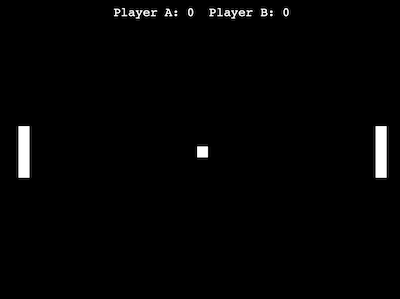

This is a python game built using a tutorial from a YouTube video [Learn Python by Building Five Games - Full Course](https://www.youtube.com/watch?v=XGf2GcyHPhc)

I also added a little bit to it since I wanted additional customizations. I also combined some of the if statements where I could. 

